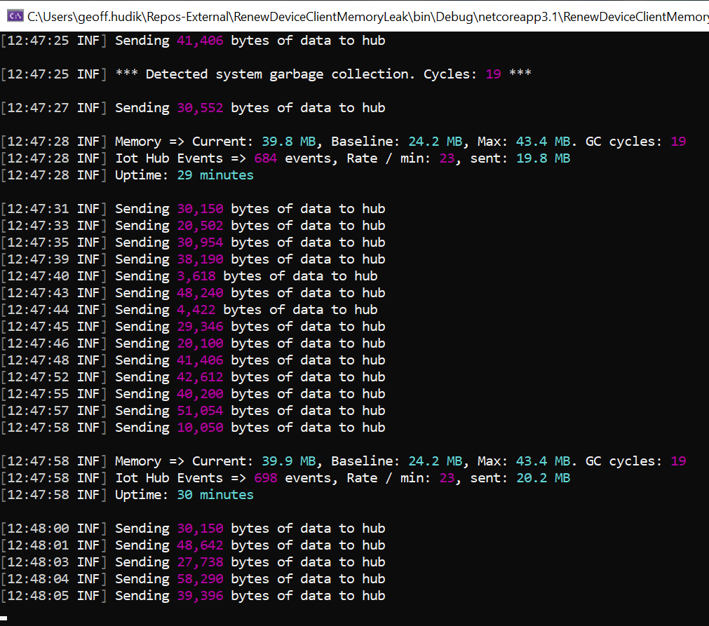

# Azure Device Client Memory Sandbox
Sandbox application to monitor memory usage with sending Telemetry events to an Azure IoT hub.

Originally the source app would forcibly recreate the Device Client every 15 minutes (due to past issues with devices losing connections). That in conjunction with other hub operations appeared to cause a runaway memory leak. Memory profiling lead to [this iot sdk discussion](https://github.com/Azure/azure-iot-sdk-csharp/issues/1169)

So far those exact conditions have not been recreated with this sample app. However memory usage with the hub does exceed expectations and not as much memory is reclaimed as would be expected.

